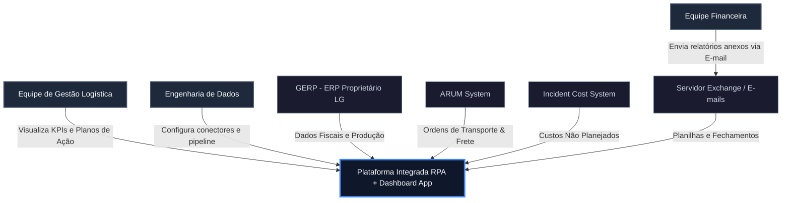
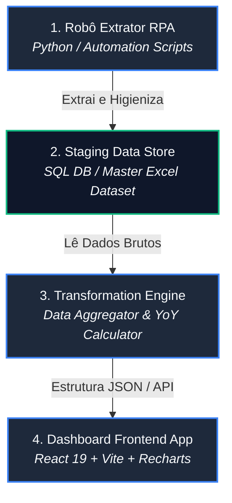
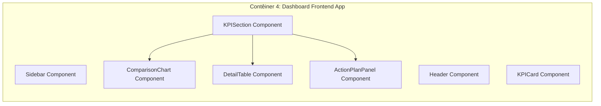

# Documentação de Arquitetura de Software — Modelo C4 (C4 Model)

**Projeto:** Ecossistema de Automação e Analytics Logístico (RPA + Dashboard App)  
**Cliente:** LG Electronics — Área de Logística e Administrativo (DXI)  
**Status:** Especificação de Arquitetura v1.0  
**Data:** 06 de Agosto de 2026  

---

## 1. Visão Geral da Arquitetura

O ecossistema de automação e inteligência logística da **LG Electronics (DXI)** é estruturado segundo os princípios da arquitetura moderna de dados e visualização web, dividindo-se em duas grande camadas operacionais:

1. **Camada de Automação & Extração (RPA):** Esteira automatizada em Python responsável por ler e-mails financeiros, realizar extração headless de relatórios do ERP (GERP/ARUM) e consolidar os arquivos na camada de staging.
2. **Camada de Analytics & Frontend (Dashboard App):** Aplicação interativa construída em **React 19**, **Vite 8** e **Recharts**, encarregada do cálculo das métricas DAX/YoY, detecção automatizada de anomalias e gestão de planos de ação.

---

## 2. Nível 1: Diagrama de Contexto de Sistema (System Context)

O diagrama de contexto detalha as fronteiras da plataforma de automação logística em relação aos atores operacionais e aos sistemas corporativos da LG.

### Elementos do Contexto
- **Plataforma Integrada (Escopo Principal):** Solução central de automação RPA e aplicação web para visualização analítica.
- **Sistemas Origem Externos:** GERP (ERP), ARUM (Fretes), Incident Cost System (Sinistros/Demurrage) e Exchange Server (E-mails).
- **Perfis de Usuários:** Solicitantes/Gestores Logísticos, Engenharia de Dados e Operações Financeiras.

---

## 3. Nível 2: Diagrama de Contêineres (Containers)

O nível de contêineres descreve as unidades de software executáveis que compõem a solução.

### Tabela de Especificação dos Contêineres

| Contêiner | Tecnologia | Função no Sistema |
|---|---|---|
| **1. Robô Extrator RPA** | Python (Pandas/IMAP) | Baixa anexos de e-mails, acessa ERP e normaliza planilhas de entrada. |
| **2. Staging Data Store** | SQL DB / Excel Master | Camada de persistência intermediária para históricos de produção e frete. |
| **3. Transformation Engine** | Python / JavaScript Engine | Aplica fórmulas de negócio (Logistic Cost %, Achievement, YoY, Anomalias). |
| **4. Dashboard Frontend App** | React 19 / Vite / Recharts | Interface gráfica interativa para navegação, filtros e acompanhamento. |

---

## 4. Nível 3: Diagrama de Componentes (Components)

Detalhamento interno dos componentes de software que formam a **Aplicação Dashboard Frontend (Contêiner 4)** e o **Robô Extrator RPA (Contêiner 1)**.

### Componentes Principais do Frontend:
- **`KPICard`:** Card resumido do topo da página com exibição de valor atual, target, badge de variação YoY e sparkline.
- **`ComparisonChart`:** Gráfico composto (Barra Realizado + Linhas Histórica e Target) com container flex ajustado para zero corte de legendas.
- **`DetailTable`:** Tabela analítica com realce condicional para melhores/piores meses e detecção de anomalias ($>2\sigma$).
- **`ActionPlanPanel` & `EvidencePanel`:** Componentes de gestão de justificativas e simulação de upload de evidências operacionais.

---

## 5. Nível 4: Diagrama Dinâmico (Dynamic Flow)

O diagrama dinâmico ilustra a sequência de execução de um ciclo completo de atualização e visualização de dados.

1. **Gatilho de Extração:** O Robô RPA é acionado e varre a caixa de entrada do Exchange buscando o relatório semanal do financeiro.
2. **Higienização:** O robô converte colunas, valida tipos e calcula os somatórios de `Custo Logístico` e `Volume de Produção`.
3. **Carga em Staging:** Os dados higienizados são consolidados no repositório de staging.
4. **Processamento do Dashboard:** O motor da aplicação web lê a estrutura atualizada, calcula a variação YoY ($2026 \times 2025$) e gera as badges de status.
5. **Renderização Interativa:** O usuário acessa a aplicação web, navega pelos painéis (`War Room Report`, `Air Freight`, `Cost x Product Amount`) e registra observações no Plano de Ação.

---

## 6. Arquitetura de Governança de Código & Modelo GitFlow

### 6.1 Registro de Débito Técnico
Todo o projeto encontra-se atualmente publicado em uma única branch (`main`). Essa estrutura representa um débito técnico de governança, aumentando o risco de regressões não intencionais durante o desenvolvimento contínuo.

### 6.2 Modelo GitFlow Proposto

Para garantir integridade corporativa e deploys seguros, propõe-se a implementação do ciclo GitFlow:

- **`main`:** Código de produção testado e homologado.
- **`develop`:** Branch oficial para integração de recursos.
- **`feature/*`:** Branches isoladas por funcionalidade (ex.: `feature/sidepanel-scroll`, `feature/rpa-connector`).
- **`release/*`:** Pacotes candidatos a lançamento.
- **`hotfix/*`:** Correções emergenciais diretamente sobre `main`.

---

## 7. Requisitos Não-Funcionais e Ajustes de Design

### 7.1 Tipografia Corporativa (Inter)
- Adoção da fonte **`Inter`** com numeração tabular (`tabular-nums`) para evitar oscilações visuais nos números dos indicadores durante a navegação.

### 7.2 Correção de Layout nas Legendas
- Adequação dos componentes de gráfico para uso de container flexbox de `360px` de altura, garantindo que as legendas (`2026 Realizado`, `2025 Ano Anterior`, `Target`) permaneçam 100% visíveis em qualquer resolução.

---
*LG Electronics — DXI Logistics Analytics Team*
